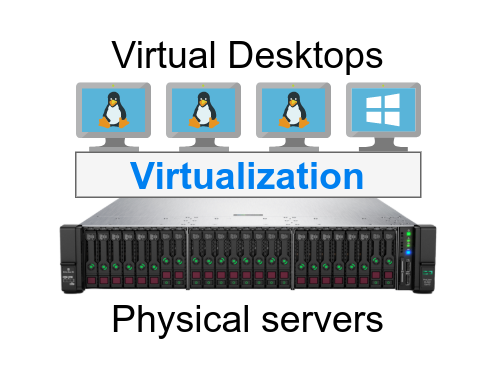

## A modern approach to VDI

Séminaire Linux, HEIAFR

<em>
TODO date
</em>

 

Geoffrey Papaux

<a href="https://github.com/papaux">
https://github.com/papaux
</a>

---

## Agenda

* VDI: what are we talking about ?
* Motivations
* Demo

---

## VDI

### (Virtual Desktop Infrastructure)

_Set of technologies providing access to remote computers_

<!-- .element: style="text-align: center" -->

- An old idea ("Citrix" does it for > 20 years)
- Recently revisited
  - thanks to technology improvements
  - due to an infamous event...

---

---
### Virtual Desktop Infrastructure

<!-- .element: style="text-align: center" -->

---
### Virtual Desktop Infrastructure

<!-- .element: style="text-align: center" -->

---

## Following the trend

<!-- .element: style="text-align: center" -->

---

## Meet DaaS

<!-- .element: style="text-align: center" -->

Desktop as a Service

---

## Benefits

1. Access from anywhere
    - Perfect for WFH

2. Security
    - No confidential files/code on laptops
    - Isolated environments
    - Especially for developers (admin/sudo ?)

---

## Benefits (2)

3. Easier IT Management
    - Easier to manage and patch

4. Happier developers
    - Access to a Linux environment
    - Performance boost from server hardware
    - Messed up your environment ? Simply rebuild!

---

## Disadvantages

1. Network requirements
    - Latency and bandwidth (client & server !)

2. Single point of failure
    - Laptops become useless without acess to VDI

---

## Disadvantages (2)

3. Requires dedicated staff
    - Self hosted: IT support and buy-in
    - Cloud: somebody still needs to setup and maintain

4. Harder to access to local hardware
    - USB, Serial, ...

---

## Options

1. Commercial provider
    - VMware, Citrix, ...

2. On-premise
    - OpenStack

3. Cloud
    - Your favorite provider

---

##

TODO
cloud options ?
VMware ?
Citrx ?

Persistent vs nonpersistent

Self hosted vs in the cloud

---

---

## Demo

