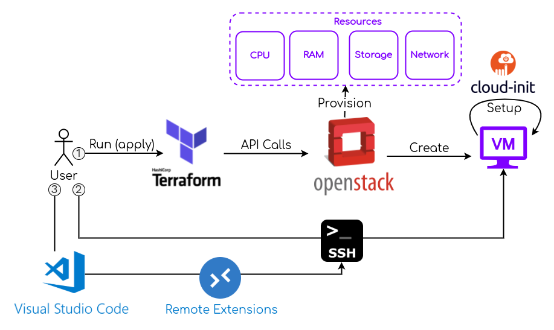

## A modern approach to VDI

 

<em>
Geoffrey Papaux, May 19, 2022
</em>

 
22nd Fribourg Linux Seminar
 

---

## About me

 

- Master in Computer Science (here at HEIA-FR 🏫)
- 5 years of embedded system development (Linux/C++)
- 3 years of data processing (Kafka/Scala/Golang/...)
- Using a VDI on a daily basis

 
  

  <a href="https://github.com/papaux">
  https://github.com/papaux
  </a>
  

  

  <a href="https://linkedin.com/in/gpapaux">
  https://linkedin.com/in/gpapaux
  </a>
  

---

## Agenda

* VDI: What are we talking about ?
* Motivations and drawbacks
* Some VDI solutions
* Demo

---

## VDI ?

<!-- .element: style="text-align: center" -->

---

## VDI

### Virtual Desktop Infrastructure

_Set of technologies for hosting and accessing virtual remote computers._

<!-- .element: style="text-align: center" -->

---

### VDI

- An old idea: **VDI alliance** created in 2006 by VMware ([link](https://news.vmware.com/releases/vdi))
  - 20+ companies including Citrix, HP, IBM, Sun
- Recently revisited thanks to...

<!-- .element: style="text-align: center" -->

---

## Google Trends "Virtual Desktop"

---
### Virtual Desktop Infrastructure

<!-- .element: style="text-align: center" -->

---
### Virtual Desktop Infrastructure

<!-- .element: style="text-align: center" -->

---

## Benefits

1. Access from anywhere
    - Perfect for WFH
    - Device flexibility

2. Security
    - No confidential files on laptops
    - Network isolation
    - Controlled environments for admin/sudo

---

## Benefits

3. IT Management
    - Easier to manage and patch

4. Happier developers
    - Access to a Linux environment
    - Server hardware => performance boost
    - Messed up your environment ? Simply rebuild!
    - Always running

---

## Disadvantages

#### Latency is your enemy!

---

## Disadvantages

1. Network requirements
    - Latency and bandwidth (client & server !)

2. Single point of failure
    - Laptops become useless without acess to VDI

---

## Disadvantages

3. Dedicated staff
    - IT support and knowledge

4. Harder to access to local hardware
    - USB, Serial, ...

---

## Cost

Commercial offerings advertise lower costs. Is it really true ?

&plus; Lower end client devices 
&plus; Optimize hardware usage 

&minus; Upfront server cost (or monthly cloud fees) 
&minus; IT staff and training 
&minus; Licensing 

---

## What's new ?

---

## Following the trend

<!-- .element: class="r-stretch" style="text-align: center" -->

---

## Meet DaaS

<!-- .element: class="r-stretch"  style="text-align: center" -->

---

## Windows 365

<!-- .element: class="r-stretch" style="text-align: center" -->

4 vCPU, 16GB RAM, 256GB SSD => $54 / month
<!-- .element: style="text-align: center" -->

---

## Shadow

<!-- .element: class="r-stretch" style="text-align: center" -->

8 vCPU, 12GB RAM, 256GB SSD, **GTX 1080** => CHF 34.99 / month
<!-- .element: style="text-align: center" -->

---

## Recap: Options for VDI

<!-- .element: style="text-align: center" -->

=> A lot of options, commercial and Free/OpenSource !
<!-- .element: style="text-align: center" -->

---

## Demo

### Let's setup a VDI!

<!-- .element: style="text-align: center; max-height: 300px" -->
---

## Demo

---

## Demo

TODO: remove ??

---

## Demo cont'd

To include:
- we are using infomaniak cloud
- description of the setup with text ?

Questions:
- who is familiar with OpenStack or has used it ?
- who is faimiliar with terraform and used it ?

---

 
Slides and code:
 
<a href="https://papaux.github.io/vdi-heiafr">
https://papaux.github.io/vdi-heiafr
</a>

---

 
Image and animation sources:
 
<a href="https://www.anyrgb.com">https://www.anyrgb.com</a>
 
<a href="https://tenor.com">https://tenor.com</a>
